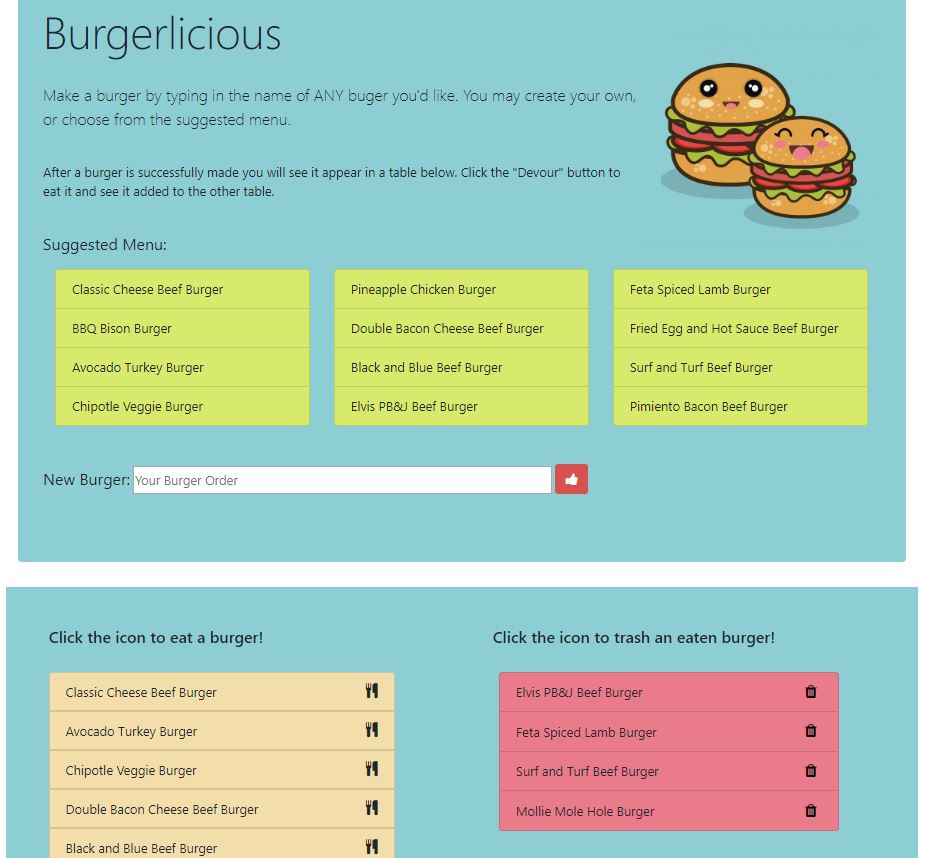

# Burgerlicious

This application uses the MVC design pattern along with a few back-end technologies to create, update, and delete burgers.

[Take me to Burgerlicious](https://burgerlicious-fire.herokuapp.com/)

## How it Works

The user can interact in a few ways:
* Text input field to create a new burger upon clicking a submit button.
* When clicking the cutlery icon a burger will update to an "eaten" or "devoured" status, moving it to a different table.
* When clicking the trash can icon a burger will be deleted from the table.

## Technologies

Bootstrap, Node.js, Express.js, path NPM, Handlebars.js, MySQL
